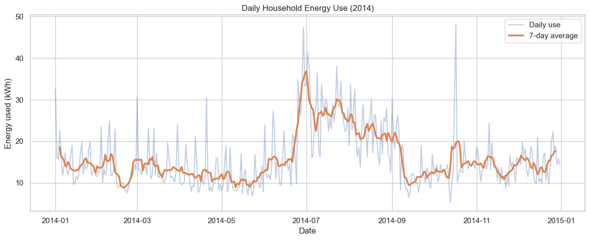
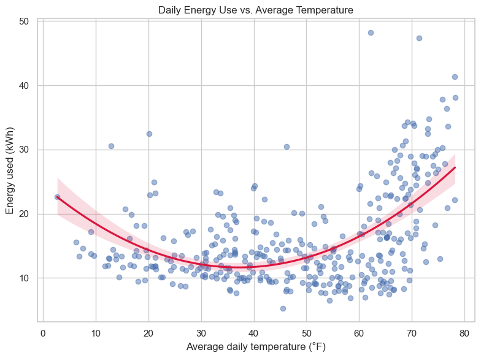
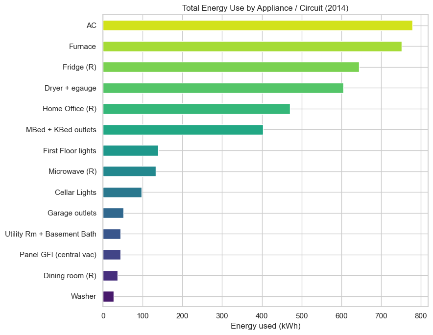
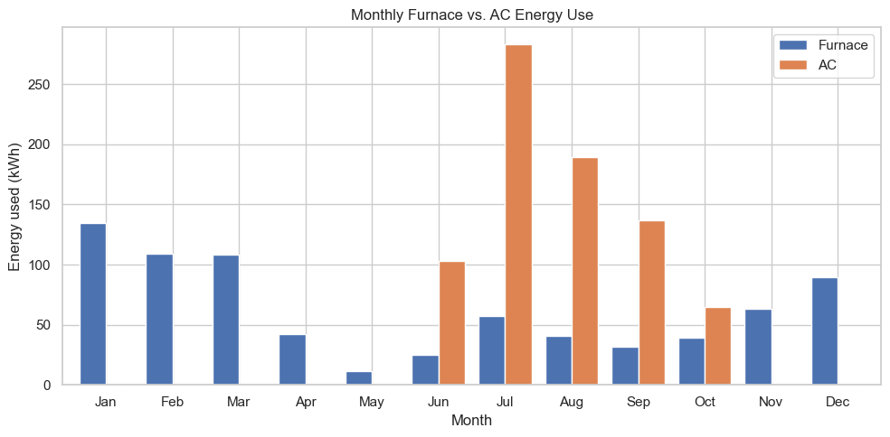
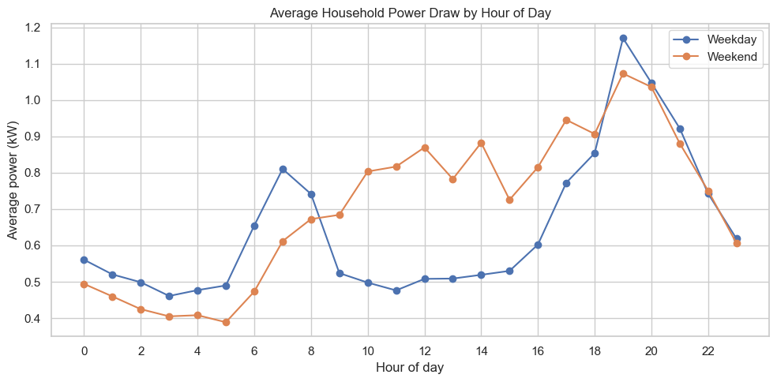
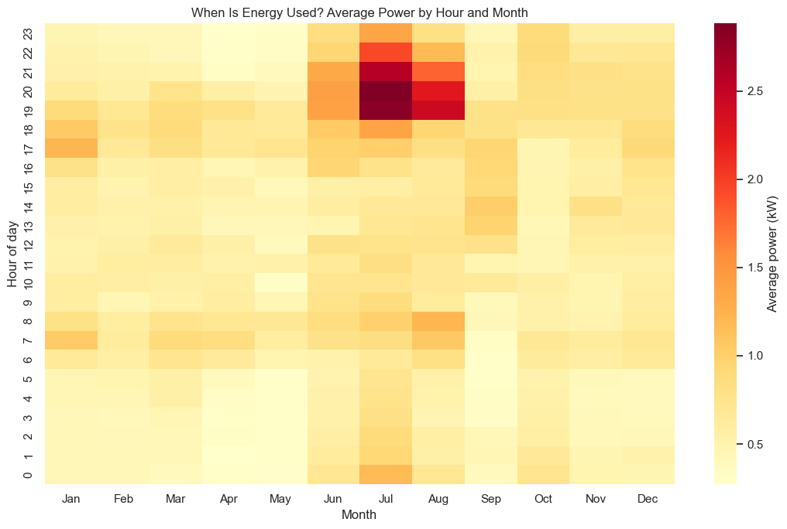
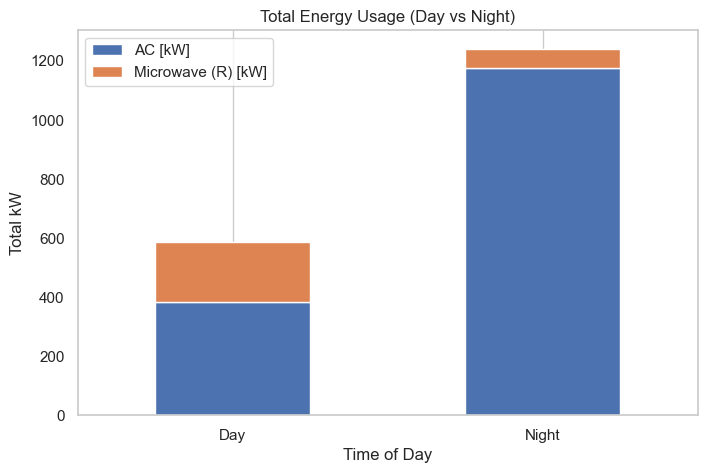
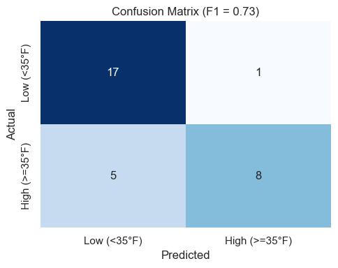

# Home Energy Use & Weather Analysis

Exploratory analysis and predictive modeling of a single household's electricity use in 2014, combined with local weather data, to understand **what drives energy demand, when it peaks, and which appliances matter most.**



## Table of Contents
- [Business Questions](#business-questions)
- [Data](#data)
- [Tools](#tools)
- [Approach](#approach)
- [Key Findings](#key-findings)
- [Predictive Models](#predictive-models)
- [Recommendations](#recommendations)
- [Limitations & Next Steps](#limitations--next-steps)
- [How to Run](#how-to-run)
- [Repository Structure](#repository-structure)
- [Contact](#contact)

## Business Questions
1. How does outdoor weather affect a household's daily electricity use?
2. Which appliances and circuits consume the most energy?
3. When during the day and year does demand peak, and how do weekdays differ from weekends?
4. Can daily energy use, or a day's temperature category, be predicted from weather data?

## Data
| Dataset | Granularity | Size | Contents |
|---|---|---|---|
| `energy_data.csv` | 30-minute readings | 17,520 rows (Jan 1 - Dec 31, 2014) | Total use plus 14 circuits/appliances (AC, furnace, fridge, dryer, home office, lighting, etc.) |
| `weather_data.csv` | Hourly readings | 8,760 rows | Temperature, humidity, visibility, pressure, wind speed, cloud cover, dew point, precipitation |

**Source:** [add dataset name and link here]

Notes: the energy data has no missing values, and on-site generation (`gen [kW]`) is zero throughout, so all demand is met by the grid. In the weather data, `cloudCover` is missing for 1,470 of 8,760 hourly readings.

## Tools
Python, pandas, NumPy, Matplotlib, Seaborn, Jupyter Notebook. Both models were implemented **from scratch with NumPy** (normal equation for linear regression, gradient descent for logistic regression).

## Approach
1. **Cleaned and aligned the data.** Parsed energy timestamps and converted weather Unix timestamps to datetimes.
2. **Aggregated to daily level.** Summed 30-minute energy readings per day (converted to kWh by multiplying by 0.5) and averaged the hourly weather variables per day, then merged the two on date (365 days).
3. **Explored the data.** Looked at the daily trend, the temperature relationship (including a quadratic fit), a correlation heatmap, appliance totals, seasonal furnace and AC use, day vs. night use, hourly weekday/weekend profiles, and an hour-by-month heatmap.
4. **Modeled the data.** Trained on January-November (334 days) and tested on December (31 days, a time-based split).

## Key Findings

### 1. Summer cooling drives the biggest demand spikes
Daily use sits around 10-20 kWh for most of the year, then climbs sharply in summer. The 7-day average peaks near 37 kWh at the start of July and stays elevated through August.

### 2. Temperature has a U-shaped relationship with energy use
Use is lowest on mild days (roughly 35-50 °F) and rises at both extremes. Hot days push consumption higher than cold days do. Because the relationship is curved, the straight-line correlation with temperature is only **0.37** (dew point: 0.36), while humidity, pressure, wind, cloud cover, and precipitation all fall between -0.11 and 0.10.



### 3. AC and furnace are the two biggest consumers
Out of **5,807 kWh** total for the year, AC used about **780 kWh (13%)** and the furnace about **752 kWh (13%)**, together roughly a quarter of all consumption. The fridge (~645 kWh) and the dryer circuit (~605 kWh) followed.



### 4. Heating and cooling follow opposite seasons, but cooling peaks higher
The furnace dominates November through April and peaks in January (~135 kWh). AC runs from June to October and peaks in July at ~283 kWh, about double the furnace's peak month.



### 5. Weekdays have two daily peaks; weekends are sustained
On weekdays, power draw peaks around 7 AM (~0.8 kW) and again around 7 PM (~1.2 kW), with a midday lull near 0.5 kW. Weekends lack the sharp morning peak and stay higher through the midday and afternoon (roughly 0.75-0.95 kW).



### 6. July evenings are the demand extreme
Between 7 and 9 PM in July, average power reaches roughly **2.5-2.9 kW**, around four times the household's all-year average of 0.66 kW.



### 7. AC runs far more at night, the microwave more in the day
Using a 19:00-06:00 "night" window (shorter than the 06:00-19:00 "day" window), AC consumption is about three times higher at night. Microwave use is about three times higher during the day. Likely explanations are that more people are home in the evening and that meals are prepared during the day, though this data can't confirm the cause.



## Predictive Models

| Task | Model | Result (December test set) |
|---|---|---|
| Predict daily total energy use from daily weather | Linear regression (normal equation) | **RMSE = 8.74** (summed 30-min kW readings, about **4.4 kWh/day**) |
| Classify a day as high (≥ 35 °F) or low average temperature using the other weather variables | Logistic regression (gradient descent, standardized features, 0.3 probability threshold) | **F1 = 0.73**, precision 0.89, recall 0.62, accuracy 81% |



The classifier is conservative: it rarely labels a cold day as warm (1 false positive) but still misses 5 of the 13 warm days, even with the decision threshold lowered to 0.3.

## Recommendations
- **Target the evening summer peak.** Shifting flexible loads (dryer, laundry) away from 7-9 PM in summer would cut peak demand, which matters most under time-of-use pricing.
- **Pre-cool before the evening peak.** Because AC use concentrates in the evening and overnight, adjusting thermostat schedules could reduce the highest-demand hours.
- **Prioritize HVAC efficiency.** AC and furnace account for about a quarter of annual use, so maintenance and smart thermostat programming are the highest-return places to look.
- **Account for non-linearity in forecasting.** Any weather-based forecast should model heating and cooling separately rather than assuming a straight-line temperature effect.

## Limitations & Next Steps
- **One household, one year (2014).** Results may not generalize to other homes or climates.
- **Small, single-month test set.** December has only 31 days, all in a cold season, while the training data spans all seasons.
- **No baseline benchmark.** The models haven't been compared to a naive baseline (such as predicting the training mean), so it's hard to say how much they add.
- **Correlated features.** Dew point and temperature correlate at 0.97, and precipitation probability and intensity at 0.90, so the classifier's inputs overlap heavily and individual feature effects can't be isolated.
- **Missing weather values.** About 17% of hourly cloud cover readings are missing; daily averages use the available readings.
- **Next steps:** add a baseline and cross-validated time-series splits, model heating and cooling degree days, try tree-based models, and forecast at the hourly level.

## How to Run
```bash
git clone https://github.com/[your-username]/[repo-name].git
cd [repo-name]
pip install -r requirements.txt
jupyter notebook notebooks/01_weather_energy_analysis.ipynb
```
Place `energy_data.csv` and `weather_data.csv` in the location the notebook reads from. The notebook also writes `linear_regression.csv` and `logistic_regression.csv` with the test-set predictions.

## Repository Structure
```
├── README.md
├── requirements.txt
├── data/
│   ├── energy_data.csv
│   └── weather_data.csv
├── notebooks/
│   └── 01_weather_energy_analysis.ipynb
├── outputs/
│   ├── linear_regression.csv
│   └── logistic_regression.csv
└── images/
```
